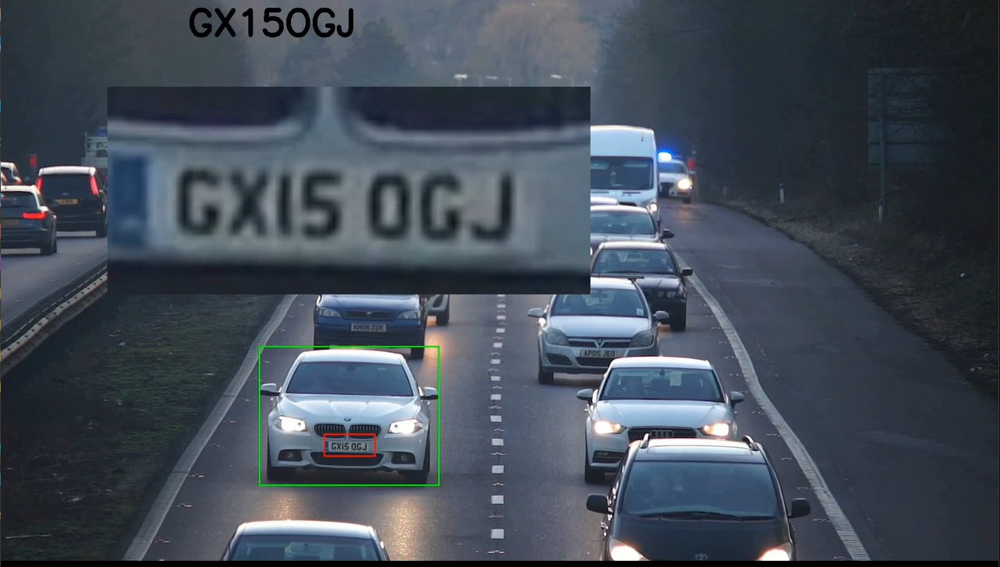

# 🚗📸 Reconnaissance des plaques d'immatriculation ! 🔍🔢

Ce projet associe l'intelligence artificielle et la vision pour identifier et suivre les véhicules en temps réel grâce à leurs plaques d'immatriculation. 🎯

## 🔹 Comment ça fonctionne ? 

✅ Détection des véhicules via YOLOv8, un modèle avancé d’IA 

✅ Suivi des trajets grâce à SORT tracking 

✅ Extraction et reconnaissance des plaques avec easyOCR

✅ Formatage intelligent des caractères pour une meilleure précision

## 📊 À quoi ça sert ? 

💡 Surveillance du trafic

🔒 Sécurité et contrôle d’accès 

🚦 Analyse des flux de circulation

L’IA repousse sans cesse ses limites pour une gestion plus intelligente et automatisée des infrastructures routières !

